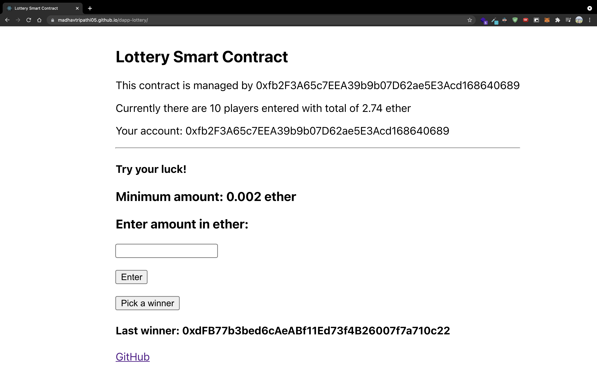
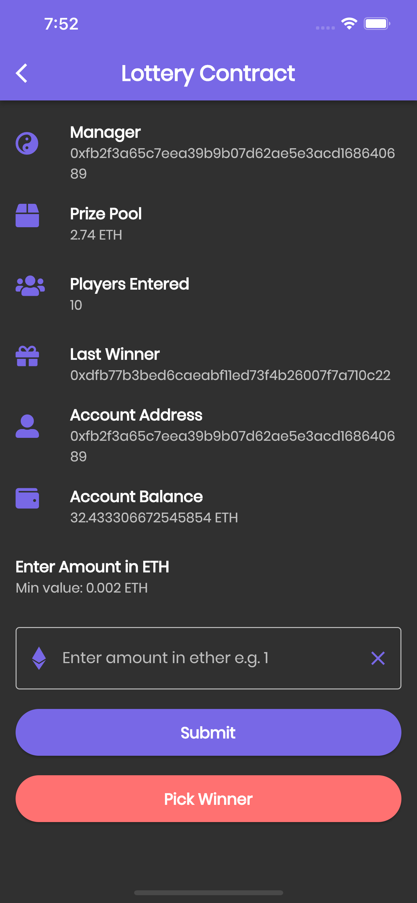
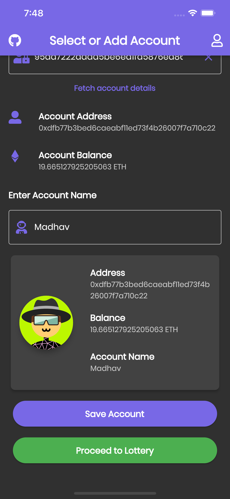
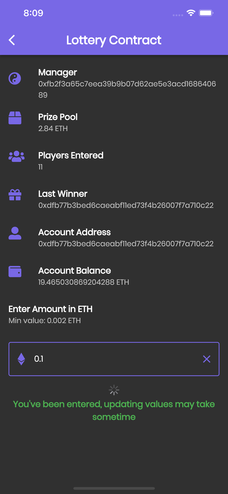

## Lottery Smart Contract built with Solidity, Flutter and React. 
* MetaMask based [React Webapp](https://madhavtripathi05.github.io/dapp-lottery/)
* Private key based [Flutter Webapp](https://lottery-m-dapp.web.app) and [APK]() for non MetaMask supported browsers and devices

### Deploy contract on the ethereum network:
* `npm i` inside root folder and [lottery-react](./lottery-react/package.json) to install dependencies.
* run `node compile.js` to compile the contract.
* run `node deploy.js` to deploy on rinkeby network.

### Deploy web app locally:
* copy the contract deployment address from console to `address` variable inside [lottery-react/src/lottery.js](./lottery-react/src/lottery.js)
* run locally with `yarn start`

### Deploy React web app on gh-pages:
* change `homepage` from [lottery-react/package.json](./lottery-react/package.json) to `https://{username}.github.io/{repo-name}`
* run `yarn deploy` to deploy on gh-pages.

### Run flutter app:
* run `flutter pub get` to install packages inside [pubspec.yaml](./lottery_flutter/pubspec.yaml).
* run `flutter run`  inside [lottery_flutter](./lottery_flutter/lib/main.dart)

